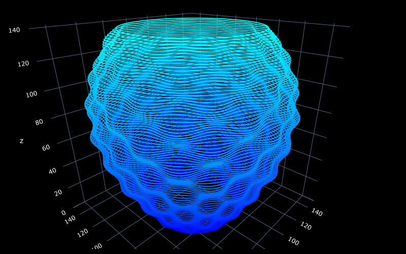
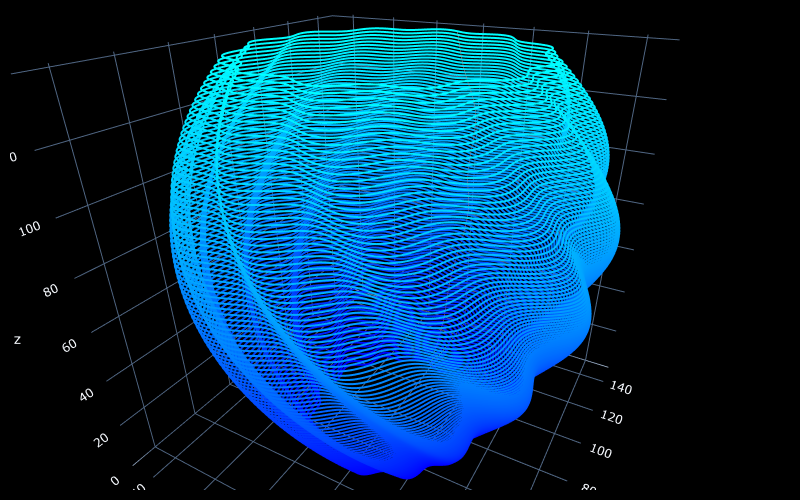
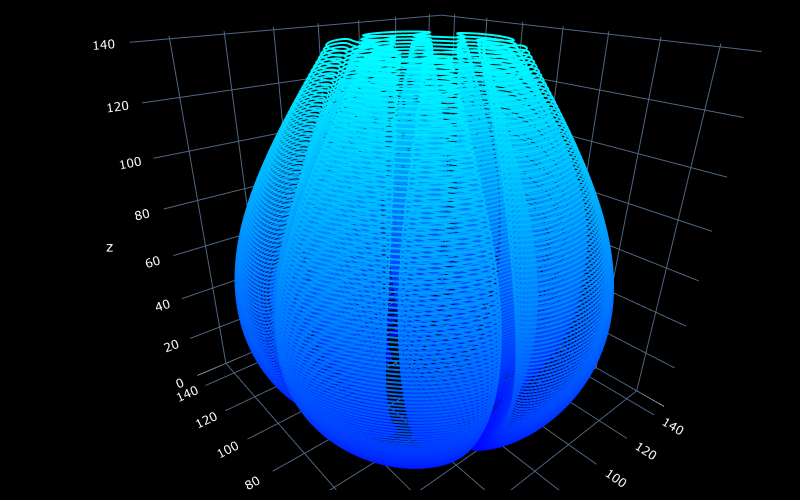

# Print with clay at CODA ExperienceLab

## Introduction

This jupyter notebook can be used as a basis to create shapes for clay 3D printing. 

It uses polar equations to define the shape to be printed.
Actually a polar equation is the only thing needed to create a new shape.
The GenerativeShape module contains necessary functions that will generate the printing instructions layer by layer
from the polar equation.

The easiest way to get started is to setup the environment then run the whole notebook (Menu Run > Run All Cells) then visualize the result. It will also generate the gcode file ready to print which can be viewed in a gcode viewer

To create a new shape, duplicate and modify one of the methods defined in the Shell class then assign it to the shell.polar_curve attribute

The various curves used to define the shapes can be explored here
https://www.geogebra.org/calculator/cfqafypg

printing parameters are defined for a Vormvrij Lutum 5M printer

All gcode generation and visualization uses the FullControl package which can be found here https://github.com/FullControlXYZ/fullcontrol

## Installation
Instructions below have been written for Windows.

### Prerequisites

To get started, you will need:
- A fairly recent version of Python. All the code here hase been tested with Python 3.12. It should include pip and venv
- Git client

### Setup the environment

- Clone this repository  

    `git clone https://github.com/xmenage/3D_clay_printing_at_CODA.git 3D_clay_printing_at_CODA`  
    `cd 3D_clay_printing_at_CODA`

- Create a virtual environment  

    `py -m venv .venv`  
    `.venv\Scripts\activate`

- Install the dependencies listed in requirements.txt  

    `py -m pip install -r requirements.txt`

- copy lutum.py to .venv/Lib/site-packages/fullcontrol/gcode/printer_library/singletool.
This last step is only needed to generate the gcode.
It is possible to run the notebook up to that last step just for visualisation purpose 

### Start the notebook

`Jupyter notebook`

This will open the jupyter home in the browser. 
Select `print_with_clay_at_CODA.ipynb` and clic `Open`
That will open the notebook in another page.

Then there are some additional instructions in the notebook itself to get started

The notebook comes with three predefined shapes.
Each shape is named by the method that defines the contour for each layer :

  
*polar_curve_bumpy*

  
*polar_curve_twisted*

  
*polar_curve_deep_sea_shell*
